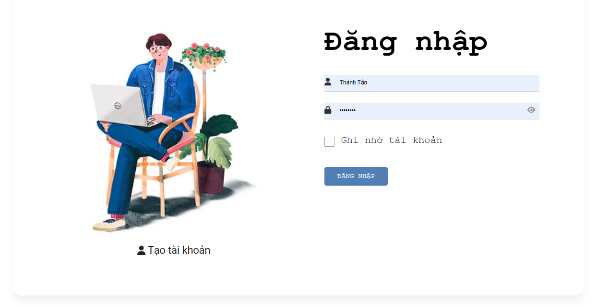
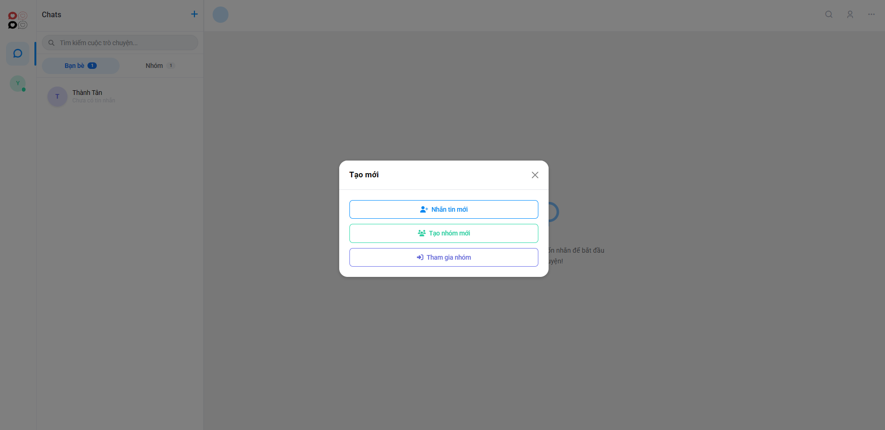
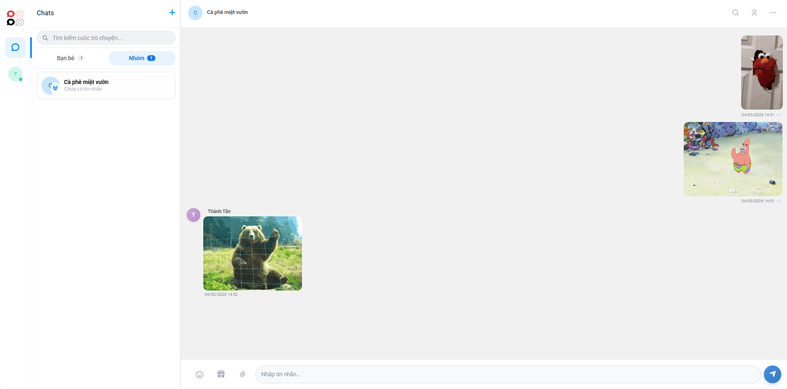

# Real-Time Web Chat Application


## Overview
A real-time web chat application built with **React**, **Node.js**, **WebSocket**, and **MySQL**.  
The application enables users to communicate instantly through private and group messaging with real-time updates.

---

## Features

- Real-time messaging using WebSocket
- Private chat between users
- Group chat support
- Multimedia and Emoji / GIF support
- Online / offline user status
- Secure logout across browser tabs
- User search with debounce optimization

---

## Tech Stack

### Frontend
- React
- Bootstrap
- WebSocket Client

### Backend
- Node.js
- WebSocket (`ws`)

### Database
- MySQL

---

## System Architecture

```

Client (React)
│
│ WebSocket
▼
Node.js Server
│
│ SQL Queries
▼
MySQL Database

```

---

## Project Structure

```

ChatSocket/
│
├── appchat/                     # React frontend
│   │
│   ├── public/                  # Static files
│   │
│   ├── src/
│   │   │
│   │   ├── assets/              # Static assets
│   │   │
│   │   ├── components/          # React UI components
│   │   │   ├── Authentication/  # Login / Register components
│   │   │   ├── Chat/            # Chat UI components
│   │   │   └── home.js          # Main home page
│   │   │
│   │   ├── img/                 # Image resources
│   │   │
│   │   ├── redux/               # State management (Redux)
│   │   │   ├── action/          # Redux actions
│   │   │   ├── reducers/        # Redux reducers
│   │   │   └── store/           # Redux store configuration
│   │   │
│   │   ├── scss/                # SCSS styling files
│   │   │
│   │   ├── security/            # Authentication & security logic
│   │   │   └── security.js
│   │   │
│   │   ├── socket/              # WebSocket client connection
│   │   │   └── socket.js
│   │   │
│   │   ├── utils/               # Utility helper functions
│   │   │   ├── convert-text.js
│   │   │   ├── protected-route.js
│   │   │   └── single-tab-auth.js
│   │   │
│   │   ├── App.js               # Main React component
│   │   ├── App.css
│   │   ├── index.js             # Application entry point
│   │   ├── index.css
│   │   ├── firebase.js          # Firebase configuration
│   │   ├── reportWebVitals.js
│   │   └── setupTests.js
│   │
│   ├── .env                     # Environment variables
│   ├── package.json
│   └── eslint.config.mjs
│
├── chatserver/                  # Node.js backend
│   ├── db.js                    # MySQL database connection
│   ├── server.js                # WebSocket server
│   ├── .env                     # Backend environment variables
│   └── package.json
│
└── README.md


````

---

## Installation

### 1. Clone the repository

```bash
git clone https://github.com/yourusername/chat-socket.git
cd chat-socket
````

---

## Backend Setup

Navigate to backend directory:

```bash
cd chatserver
```

Install dependencies:

```bash
npm install
```

Create `.env` file:

```
DB_NAME=chatapp
PORT=8080
WS_PATH=/chat
DB_NAME=chatapp
DB_USER=root
DB_PASSWORD=yourpassword
DB_HOST=localhost
DB_DIALECT=mysql
DB_POOL_MAX=10
DB_POOL_MIN=0
DB_POOL_ACQUIRE=30000
DB_POOL_IDLE=10000
SESSION_PREFIX=sess_
RELOGIN_PREFIX=nlu_
TIMEZONE_OFFSET=7
KEEP_ALIVE_INTERVAL=30000
SESSION_CLEANUP_INTERVAL=60000
SESSION_TIMEOUT=90000
LOGOUT_DELAY=5000
```

Start the backend server:

```bash
node server.js
```

Backend server will run at:

```
http://localhost:8080
```

---

## Frontend Setup

Navigate to frontend directory:

```bash
cd appchat
```

Install dependencies:

```bash
npm install
```

Run the React application:

```bash
npm start
```

Frontend will run at:

```
http://localhost:3000
```

---

## Database Setup

Create MySQL database:

```sql
CREATE DATABASE chatapp;
```

## Chat Interface

### Login Page


### Chat Modal


### Chat


---

## Future Improvements

* Message read receipts
* File and image sharing
* Message encryption
* Push notifications
* Scalable WebSocket architecture
* Mobile responsive UI improvements

---

## Author

**Cao Thanh Tan**

Software Engineering Graduate
Backend / Java Developer

GitHub: [https://github.com/yourusername](https://github.com/yourusername)

---

## License

This project is licensed under the MIT License.

